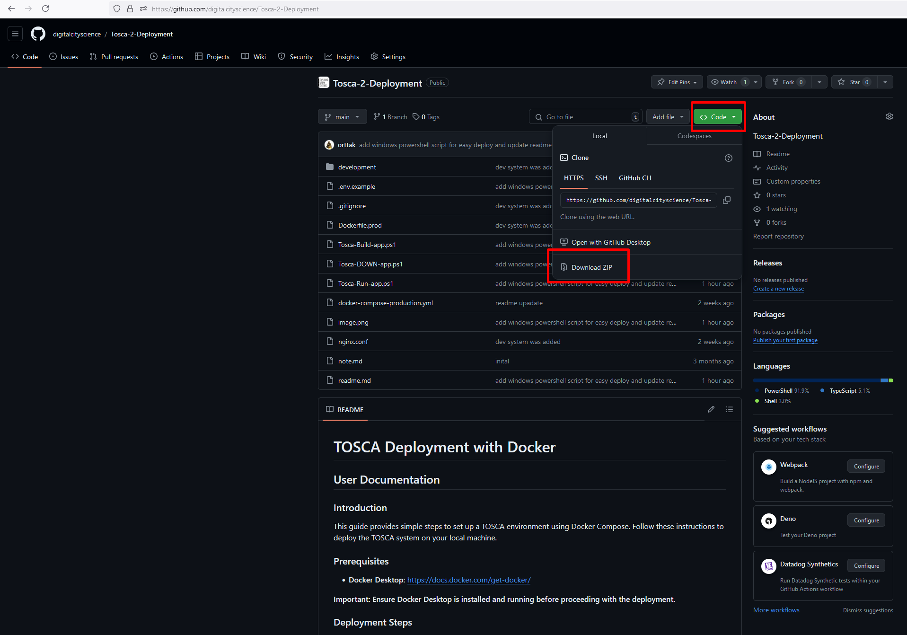
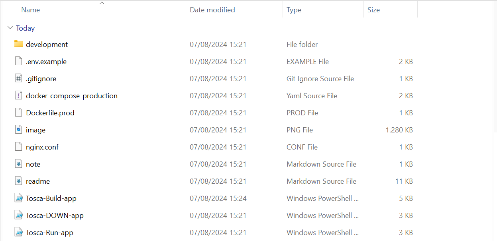
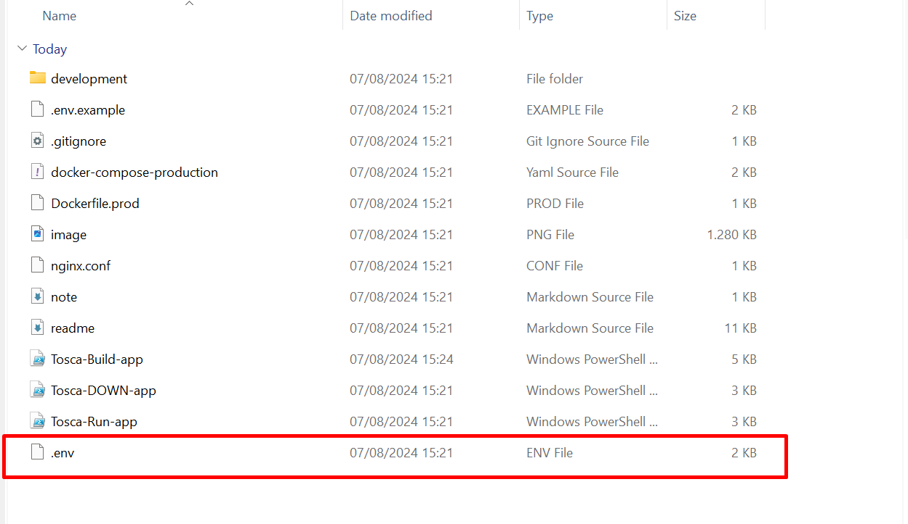
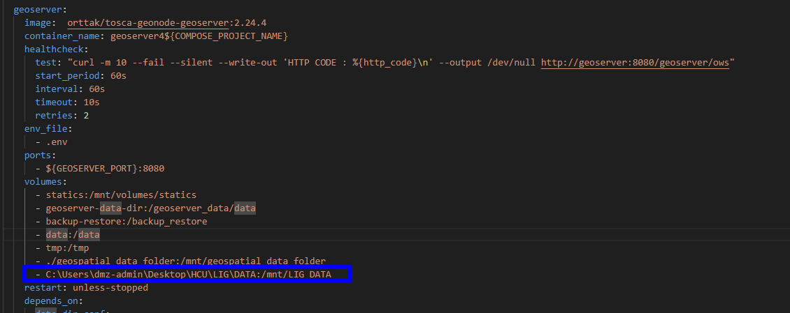
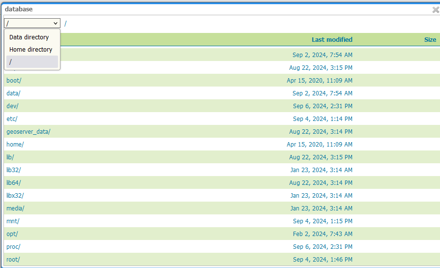
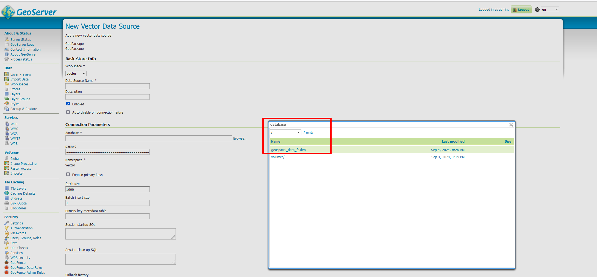
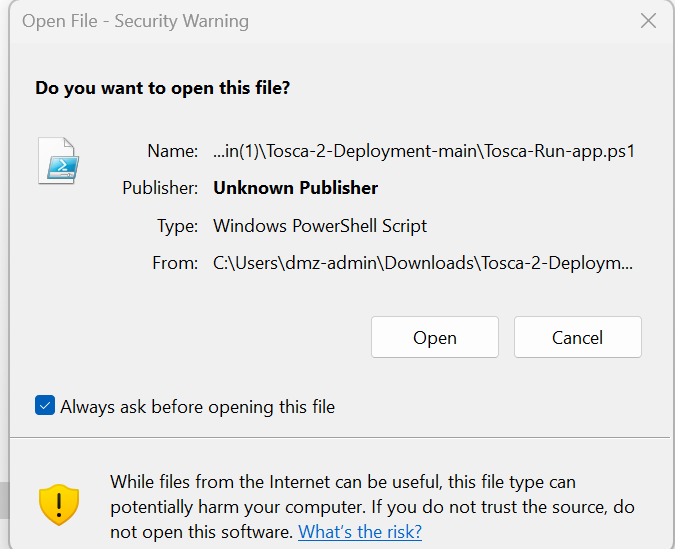
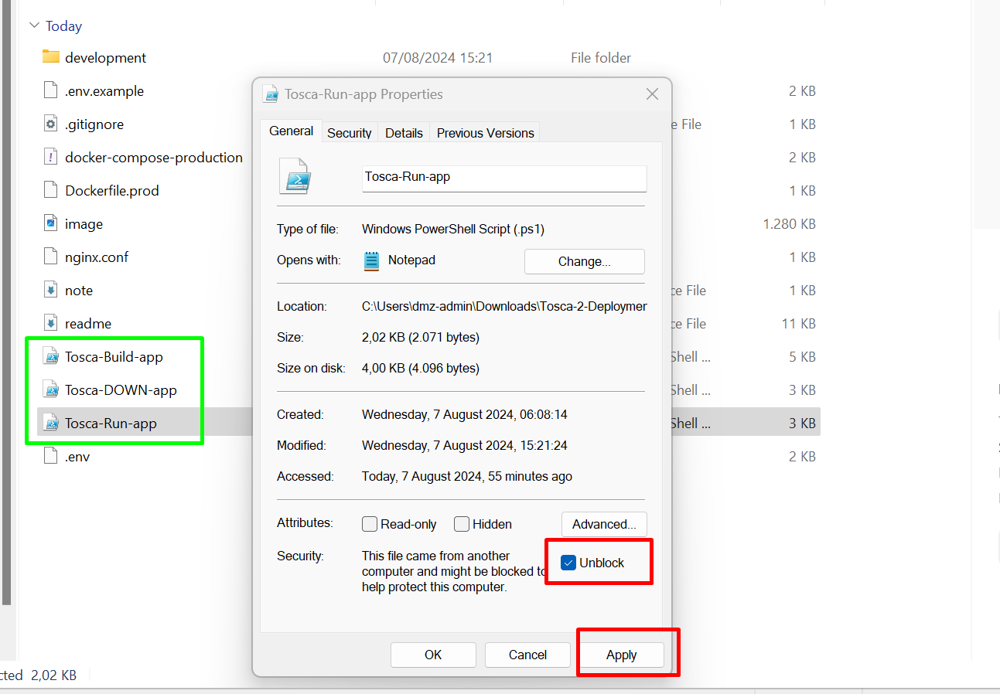
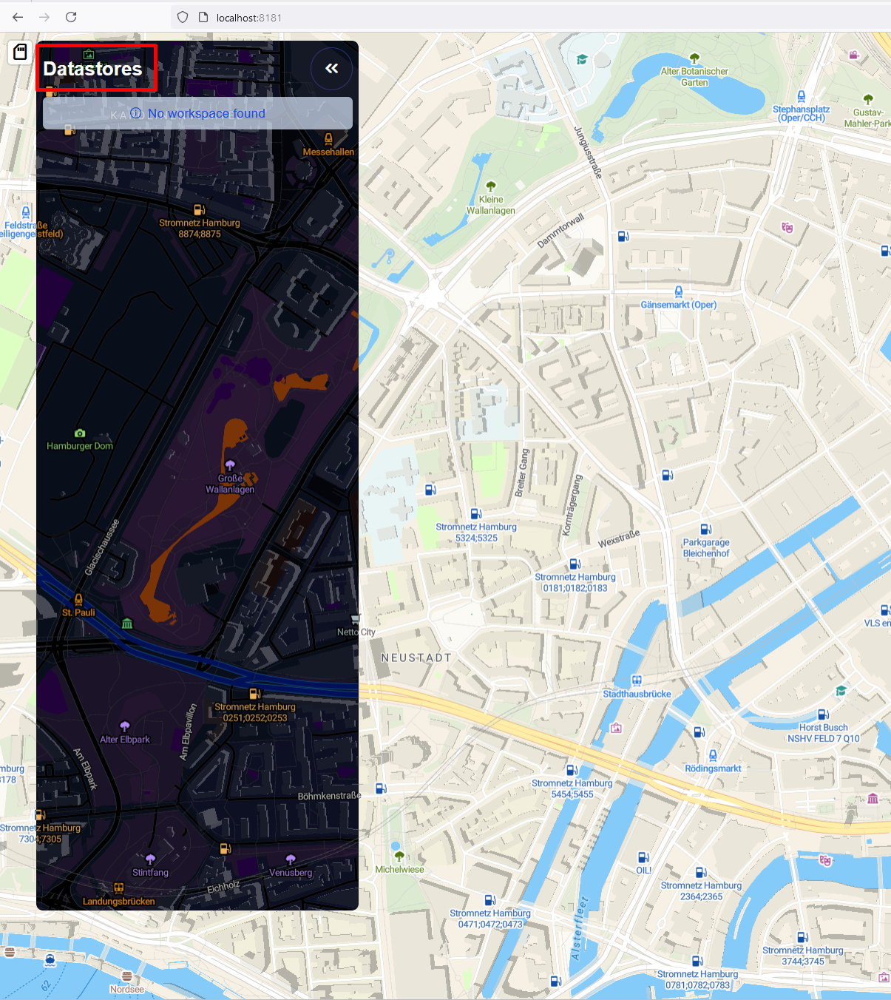

# TOSCA Deployment with Docker

## Introduction

This document is divided into two main sections: User Documentation and Developer Documentation.

**User Documentation**: This section is intended for general users who want to quickly set up and run the TOSCA system on their local machine with minimal involvement. It provides straightforward instructions to get the application up and running.

**Developer Documentation**: This section is designed for developers or advanced users who may need to customize, update, or troubleshoot the TOSCA system. It includes more detailed technical instructions and considerations for working with the underlying infrastructure.

Please follow the section that best matches your role or level of expertise.

## User Documentation

This guide provides simple steps to set up a TOSCA environment using Docker Compose. Follow these instructions to deploy the TOSCA system on your local machine.

### Prerequisites

- **Docker Desktop:** [https://docs.docker.com/get-docker/](https://docs.docker.com/get-docker/)

**Important: Ensure Docker Desktop is installed and running before proceeding with the deployment.**

### Deployment Steps

1. **Download and Extract TOSCA Zip File**
   - Download the TOSCA deployment zip file.
   
   - Extract the contents into your target folder.
   


2. **Create the `.env` File**
   - Copy the `.env.example` file and rename it to `.env`. It should be same directory as docker-compose and Tosca-XXX-app.ps1 scripts.
   
   - Open the `.env` file and set your MapTiler API key: 
    - You can use ***VsCode*** appliction to make this changes or you can also use ***Notepad*** application in Windows.
    > - Obtain your MapTiler API key
    > - Go to the MapTiler website: https://docs.maptiler.com/cloud/api/authentication-key/
    > - Create an account if you don't have one already.
    > - Navigate to the "Account" section and then "API Keys."
    > - Create a new key specifically for local development (do not use the default key in production environments).
    > - Copy your newly created API key.

Update the .env file: Replace the placeholder value (=) with your actual MapTiler API key in the .env file. Ensure there are no spaces between the variable name and the key itself.
     ```
     VITE_MAPTILER_API_KEY=your_actual_maptiler_api_key
     ```
  <br>
   - The application will open with the default location as ***Kochi***. To change this location, update the respective coordinates in the `.env` file.

   - **Note:** Without the correct MapTiler API key, the application will not start.
   <br>

3. **Verify Geospatial Data Folder**
   - If you want to upload geospatial raw data such as .shp, geopackage, etc., to GeoServer, place the data in the default `geospatial_data_folder`. If you want to map different files into GeoServer, read the developer mode section below on Docker Compose volume mapping or refer to various online resources on the topic.

       - C:\Users\dmz-admin\Desktop\HCU\LIG\DATA:/mnt/LIG_DATA
       

4. **Copy Your Data into Geospatial Data Folder**
   - When uploading data within GeoServer, you can see all your files when you create store in Geoserver web UI. Under the `/mnt/data` path in the store section. To access the `/mnt/data` folder, navigate to the "/" root directory.

   
   then
   

5. **Running the Deployment Scripts**
   - Carefully read the "Running the Deployment Scripts" section and follow the steps accordingly.


### Important Notes

- **Docker Desktop:** Ensure Docker Desktop is running before executing any scripts.
- **MapTiler API Key:** Make sure to update your `.env` file with the correct MapTiler API key and other necessary parameters before building the application.
- For any issues or further customization, please go to TOSCA [wiki page](https://github.com/digitalcityscience/TOSCA-2/wiki)  or follow developer documentation section

### Running the Deployment Scripts
> [!WARNING] 
> When running the scripts below, you might encounter a security error, as shown in the image. If you >  are not an admin on your computer, you will need assistance from your IT department.
 

 

> Workshop erro please run below code within Powershell. Please write search Powershell and run as a admin.
> If command-line shows prompt same as below image please press "A" and approve for all script

 ```
set-executionpolicy remotesigned 
 ```


> [!WARNING] 
> To resolve this issue, unblock the script from the "Properties" menu. Make sure to perform this step for all the scripts shown in the image below.



  #### **1-Build the Application (First Time or After Updates)**
  - Right-click on the `Tosca-Build-app.ps1` script and select "Run with PowerShell".
  - This script will:
    - Check if Docker Desktop is running.
    - Verify the `.env` file and its parameters.
    - Build and start the Docker containers.
    TOSCA Web App: http://localhost:8181
    GeoServer: http://localhost/geoserver/web


**Note:** If you receive a notification from the TOSCA team about an update, you will need to rerun this script. Your data in GeoServer and PostGIS will not be lost; only changes in the frontend will be applied. During this update process, the role of the `.env` file is crucial. Carefully read the email from the TOSCA team, and if there are any changes needed in the `.env` file, they will be highlighted.

To apply the update:

1. Make the necessary changes in the `.env` file as instructed. 
2. Right-click on `Tosca-Build-app.ps1` and select "Run with PowerShell" to run the script and apply the update.

#### **2-Start the Application**
  - Right-click on the `Tosca-Start-App.ps1` script and select "Run with PowerShell".
  - This script will start the Docker containers.
  - Key Access Points with Default Port Settings:
    TOSCA Web App: http://localhost:8181
    GeoServer: http://localhost/geoserver/web

#### **3-Stop the Application**
  - Right-click on the `Tosca-Stop-App.ps1` script and select "Run with PowerShell".
  - This script will stop the Docker containers.

---

**After deployment please go to [Wiki page](https://github.com/digitalcityscience/TOSCA-2/wiki) of TOSCA**

---
### Citizen Participation Tool

This module is still under development. To see this version, there are two important steps that must be completed before starting the system.

  1. Configure .env File:
        - Before starting the system, you need to define the relevant parameters in the .env file. You must specify the target workspace (VITE_PARTICIPATION_DEMO_WORKSPACE), the target layer (VITE_PARTICIPATION_DEMO_LAYER), and the target coordinates for the Citizen Participation Tool (CTP).

    Example entries in the .env file:
    VITE_PARTICIPATION_DEMO_LAYER="ctp_layer"
    VITE_PARTICIPATION_DEMO_WORKSPACE="CTP"

To access the CPT module, click on the datastore located at the top left of the TOSCA web app. In the next update, the CPT will have its own dedicated interface. This functionality has been implemented this way for development purposes. You can see an example in the image below.


---

## Developer Documentation

**Prerequisites**

- **VS Code:** [https://code.visualstudio.com/](https://code.visualstudio.com/) (integrated development environment)
- **Docker Desktop:** [https://docs.docker.com/get-docker/](https://docs.docker.com/get-docker/) (containerization platform)

### Pre-Deployment Considerations

Before embarking on the deployment process, it's essential to familiarize yourself with these key guidelines:

**Environment Selection:**

- **Local Development:** Utilize the `docker-compose-production.yml` file for streamlined development on your machine.

**Port Mapping:**

- Port mapping plays a crucial role in ensuring proper application communication. Refer to the `docker-compose-production.yml` file to view all port mappings for the various components. If no conflicting applications are running on your computer, the default ports will function seamlessly.
  - Application ports are also documented in either the `.env` file or `docker-compose-production.yml` file for easy reference.
  - Key Access Points with Default Port Settings:
    - TOSCA Web App: http://localhost:8181
    - GeoServer: http://localhost:8080/geoserver/web
    - PostGIS Connection: localhost:5435

**Data Mapping:**

- Data mapping establishes a bridge between your local data and the containerized environment.
- For local vector data (e.g., GeoPackage, Shapefile), meticulously examine the `volumes` section for Geoserver within `docker-compose-production.yml`. This section specifies how your local data directory is mapped to the container's file system. Detailed instructions on data mapping are provided later in the documentation.

**PostGIS Data Storage (Recommendation):**

- If you envision using PostGIS for data storage, we strongly recommend employing desktop GIS software like QGIS or ArcGIS to efficiently populate the database. Once data is successfully loaded, you can proceed with publishing it through GeoServer. Detailed guidance on PostGIS integration is available in a separate section (link or reference to the section).
  <br>
  [Loading data into Postgis](https://www.crunchydata.com/blog/loading-data-into-postgis-an-overview)
  [Getting started with Postgis ](https://docs.geoserver.org/main/en/user/gettingstarted/postgis-quickstart/index.html)
  [Define Postgis as Datastore in Geoserver](https://docs.geoserver.org/main/en/user/data/database/postgis.html)

<br>

### Steps

**Clone the Repository**

Clone this repository to your local machine using Git or download it as a ZIP archive.

If you download as a ZIP file please open ZIP file to your target directory (`Desktop/Tosca-2-Deployment` in the example).

**Open the Project in VS Code**

- Launch VS Code.
- In the File menu, select "Open Folder."
- Navigate to the downloaded TOSCA repository directory and click "Open."

**Open a Terminal**

- In VS Code, click the terminal and open new terminal. If you use small screen, you will see 3 dots (...) in the menu bar. Please click and see terminal menu.
- Ensure the terminal working directory is set to the project root (`Desktop/Tosca-2-Deployment` in the example).

**Create the `.env` File**

- **Recommended:** Generate the `.env` file by copying the `.env.example` file and renaming it to `.env`.
- **Alternative:** Create a new file named `.env` in the project root.

**Obtain your MapTiler API key**

- Go to the MapTiler website: https://docs.maptiler.com/cloud/api/authentication-key/
- Create an account if you don't have one already.
- Navigate to the "Account" section and then "API Keys."
- Create a new key specifically for local development (do not use the default key in production environments).
- Copy your newly created API key.

Update the .env file: Replace the placeholder value (=) with your actual MapTiler API key in the .env file. Ensure there are no spaces between the variable name and the key itself.

For example:

```
VITE_MAPTILER_API_KEY=your_actual_maptiler_api_key
```

**Optional Environment Variables**

The `.env.example` file might contain other configuration options. Review them and adjust as needed. for your specific deployment.

**Verify Data Mapping**

If you're using Windows, ensure the data mapping between your local computer and the GeoServer container is correct. The data directory on your host machine should be mapped to `/mnt/data` within the container.

For example, if your local data directory is `C:\Users\<username>\Desktop\geoserver_data`, the corresponding line in `docker-compose-dev.yml` should be:

```yaml
volumes:
  - tosca-2-geoserver-production:/usr/share/geoserver/data_dir
  - LOCAL_FOLDER_FULL_PATH:/mnt/data
```

When yoou upload data within Geoserver, you should go /mnt/data folder to see all data.

1. **Build and Run the System (First Time Only)**

   - To build the Docker images for the first time, run:

     ```bash
     docker-compose -f docker-compose-dev.yml build
     ```

   - To start the entire TOSCA deployment system in detached mode (background process), run:

     ```bash
     docker-compose -f docker-compose-dev.yml up -d
     ```

2. **Access the Applications**

   - Once the containers are running, you can access them using the following URLs:
     - GeoServer: http://localhost:${GEOSERVER_PORT}/geoserver
     - Web Application: http://localhost:8181

**Updating the Tool**

If you're a developer updating the TOSCA tool:

1. **Stop the Existing System**

   If the system is currently running, stop it using:

   ```bash
   docker-compose -f docker-compose-dev.yml down
   ```

2. **Update and Rebuild**

   - To update the tool code and rebuild the Docker images without using cached layers, run:

     ```bash
     docker-compose -f docker-compose-dev.yml build --no-cache
     ```

   - Restart the system using the command from step 1.

   ```bash
     docker-compose -f docker-compose-dev.yml up -d
   ```

```
**Additional Notes**

- Consider using a version control system like Git to manage code changes.
- Refer to the official Docker Compose documentation for more advanced usage: [https://docs.docker.com/compose/](https://docs.docker.com/compose/)
- For production deployments, consult the TOSCA documentation for more robust configurations.
```
